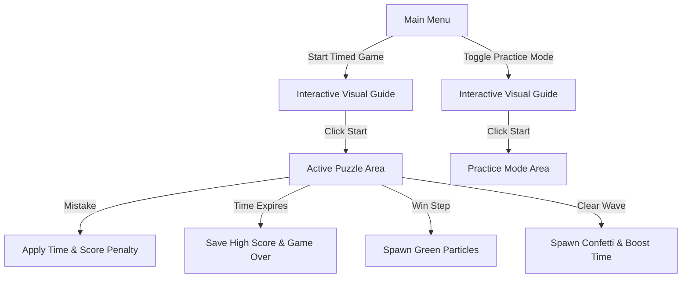

# Sort Pulse 🎮

**Sort Pulse** is an intense, timed arcade puzzle game and interactive algorithm trainer. Players race against the clock to sort randomized block grids using real-world sorting algorithms: **Selection Sort**, **Bubble Sort**, **Insertion Sort**, **Quick Sort**, and **Merge Sort**.

This repository contains the complete codebase, launch scripts, font assets, technical documentation, and packaging utilities to run the game as a standalone native desktop application.

<p align="center">
  
  
</p>

---

## 📚 Technical Documentation & Resources

* 📄 **[Technical Documentation (Markdown)](DOCUMENTATION.md)**: Full design specifications, MVC architecture, sorting algorithms analysis, complexity charts, and individual reflection.
* 🌐 **[Print-Ready Documentation (HTML)](DOCUMENTATION.html)**: Clean, paginated 8-page formatted report with code snippets, diagrams, and print styles.
* 📱 **[Android & Kotlin Migration Guide](ANDROID_MIGRATION_GUIDE.md)**: Architectural blueprint for porting the game to Android using Jetpack Compose and Coroutines.
* 🖼️ **[Screenshot Gallery](screenshots/)**: Collection of 30 in-game screenshots covering all tutorials, game modes, pause menus, and themes.

---

## 📸 Key Features

* **Five Unique Algorithm Modes:** Manually drive the step-by-step logic of Selection, Bubble, Insertion, Quick, and Merge Sort.
* **Dual Aesthetics & Theme Engine:** Toggle between the vibrant **Classic Neon** (default) or the retro **GameBoy Retro** (desaturated DMG LCD color palette with grayscale anti-aliasing for crisp text).
* **Retro CRT Scanlines & Vignette:** Optional post-processing filter (`[C]`) drawing simulated horizontal CRT phosphors and edge vignetting.
* **Dynamic Screen Shake Engine:** Procedural physics screen-shake impulses triggering on mistakes, high combo runs, and wave clears for visceral arcade game feel.
* **Hybrid Keyboard & Mouse Controls:** Play with `[A]`/`[D]`, Arrow Keys, Spacebar, or directly click and hover blocks on the canvas.
* **Audio Controls & Procedural Synth:** 8-bit dynamic runtime synthesizer with master volume slider and instant mute toggle (`[M]`).
* **Tutorial Overlay Visual Guides:** Interactive, step-by-step animated previews for all five algorithms to help players learn the mechanics before starting.
* **Practice Mode:** Train with zero timer pressure or penalty calculations.
* **Colorblind Accessibility & Symbol Mode:** Toggleable (`[V]`) shape signifiers (`[✓]` checkmark pills for sorted blocks, `★` stars for pivots, `▲` chevrons for merge heads) and high-contrast text outlines for universal legibility across all vision types and displays.
* **In-Game Algorithm Rulebook:** Instant reference card available directly inside the Pause Menu (`[ESC]`) explaining mechanics, indicators, and pro-tips on the fly without abandoning current match progress.
* **Combo Multiplier & Fever Mode:** Stack consecutive correct moves to trigger score multipliers and pulsing visual indicators. Reaching 5+ combo unlocks **Fever Mode** with double points ($2\times$), glowing chromatic neon borders, edge sparks, and ascending pentatonic chimes.
* **Elastic Landing Bounce:** Blocks settling into destination slots apply organic squash-and-stretch spring physics for tactile mechanical snap.
* **Juicy Vector Particle Engine:** Custom physics particle bursts erupting on correct/incorrect actions, plus falling confetti cascades on wave completion.
* **High Score Leaderboard:** Automatically saves and displays top 5 runs for each algorithm mode locally in `sort_pulse_scores.txt`.
* **Crisp Font Rendering:** Enforces integer-size loading and caching for pixel-art fonts ("Press Start 2P") to prevent high-DPI scaling blurriness.
* **One-Click Native Executable:** Standalone packaging script that bundles a custom JRE and JavaFX modules, allowing click-and-play without external JDK installations.

---

## 🧰 Prerequisites (For Building from Source)

If you wish to compile and run the source code directly:

| Prerequisite | Recommended Version |
|---|---|
| **Java Development Kit (JDK)** | Version **21 or higher** (JDK 25.0.2 recommended) |
| **OpenJFX (JavaFX SDK)** | Version **21 or higher** (JavaFX SDK 25.0.1 recommended) |

> **JavaFX SDK Download:** Get the SDK zip package matching your OS from [Gluon OpenJFX](https://gluonhq.com/products/javafx/). Extract it to a path of your choice.

---

## 🚀 Compilation & Launch Setup

### 🪟 Windows (Quick Run)
1. Double-click `run.bat` or run it from command line:
   ```cmd
   run.bat
   ```
2. On first run, the script will prompt you to enter the absolute path to your JavaFX SDK folder (e.g., `C:\javafx-sdk-25.0.1`). It saves this to `javafx_path.txt` so subsequent launches run instantly.

### 🐧 macOS / Linux (Quick Run)
1. Give execute permissions to the shell script:
   ```bash
   chmod +x run.sh
   ```
2. Run the script:
   ```bash
   ./run.sh
   ```
3. Enter your JavaFX SDK path when prompted.

---

## 📦 Standalone Packaging (Build Native EXE)

Sort Pulse includes a `package.bat` script that uses `jlink` and `jpackage` to compile and package the game into a self-contained portable Windows application.

1. Ensure you have the **JDK** and **JavaFX SDK** paths set.
2. Run the packaging utility:
   ```cmd
   package.bat
   ```
3. This creates a directory under `dist/SortPulse/` containing:
   * **`SortPulse.exe`**: A native launcher executable.
   * **`runtime/`**: A stripped-down, lightweight Java Runtime (JRE).
   * **`app/`**: Application class libraries and bundled resources.
4. Distribute the `SortPulse` folder to any Windows computer—it will run with a single click, requiring no Java setup!

---

## 📖 Complete Game Manual & Documentation

### 🕹️ Game Flow & Modes



#### 1. Timed Blitz Mode
* You start with a limited clock (20s for Selection Sort, 40s for Quick/Merge/Bubble/Insertion).
* Correct steps extend the timer (`+10s` for Selection, `+15s` for Bubble/Insertion/Quick, and `+30s` for Merge Sort).
* Incorrect steps subtract `-3s` from the timer and deduct `-25 points`.
* The game ends when the timer hits zero.

#### 2. Practice Mode
* Enable this by checking the **PRACTICE MODE (NO TIMER)** box on the main menu.
* The timer displays **PRACTICE** and will not count down.
* All time and score penalties on incorrect actions are disabled, letting you learn the algorithm at your own pace.
* **Step-Back / Undo (`[Z]`):** Made an accidental move or want to review a step? Press `Z` to instantly rewind the puzzle state, step counter, and selection cursor to the previous step with full visual feedback.

---

### 📊 Educational Analytics & Algorithmic Report Card

* **Live HUD Metrics:** Real-time tracking of:
  * **Algorithm Complexity:** Live Big-O notation indicator ($O(n \log n)$, $O(n^2)$).
  * **Live Accuracy & Grade:** Real-time accuracy percentage and responsive performance grade badge (`S`, `A`, `B`, `C`, `D`).
  * **Operation Counter:** Total valid algorithmic swaps and partition assignments executed.
  * **Practice Step Tracker:** Exact current step vs. total steps required to sort the wave (`STEP: X / Total`).
* **Post-Match Algorithmic Report Card:**
  * **Proficiency Rank Badge:** Displays calculated rank based on speed and algorithmic precision.
  * **Deep Decision Stats:** Summarizes total swaps, mistakes, net accuracy percentage, and average decision time per move (in milliseconds).
  * **Local High Scores:** Persistent Top 5 local leaderboard per session.

---

### 🧮 Score & Combo System
* **Correct Move:** Adds `10 × current combo` to your score (doubled to `20 × current combo` during **Fever Mode**).
* **Combo Count:** Increases by `1` with every correct move. When you have `2` or more consecutive correct moves, a pulsing **COMBO xN** banner is displayed.
* **Ascending Pentatonic Audio:** Correct moves ascend through a harmonic pentatonic scale ($C_5 \to D_5 \to E_5 \to G_5 \to A_5 \to C_6 \dots$), turning sorting streaks into a musical performance.
* **🔥 Combo Fever Mode ($\ge 5$ Combo):**
  * **Double Score Multiplier:** All successful moves award $2\times$ combo points.
  * **Chromatic Neon Border:** The screen boundary pulses with oscillating gold and magenta energy and trailing edge sparks.
  * **Arpeggiated Fanfare:** Triggering Fever Mode plays a triumphant 3-note arpeggiated chord.
* **Mistakes:** Resets the active combo counter back to `0`, cancelling Fever Mode with an immediate screen shake.
* **Elastic Landing Bounce:** Blocks settling into destination slots briefly squash ($0.92\times$ height) and stretch ($1.08\times$ width) with spring physics for tactile mechanical weight.
* **Wave Completion Score:**
  $$\text{Score Reward} = 100 + \max(0, \text{Timer} \times 10 - \text{Mistakes} \times 30)$$
  *Clear waves quickly and accurately to maximize speed bonuses.*

---

### ⌨️ Controls & Input Schemes

Sort Pulse supports both full keyboard controls and direct mouse interactions:

| Control | Gameplay Action | Visual Guide Action |
|---|---|---|
| `A` / `←` | Move Selection Cursor Left | Navigate to Previous Slide |
| `D` / `→` | Move Selection Cursor Right | Navigate to Next Slide / Start Game |
| `ENTER` / `SPACE` | Execute Shift / Swap Action | Start Game (on final slide) |
| `Z` | Undo last move (Practice Mode step-back) | — |
| `V` | Toggle Colorblind Accessibility Symbols & Outlines | — |
| **Mouse Hover** | Highlight block under cursor with soft glow | — |
| **Mouse Left-Click** | Click block to select; click selected block to execute | Click navigation buttons |
| `M` | Toggle Audio Mute / Unmute instantly | — |
| `C` | Toggle Retro CRT Scanlines & Vignette | — |
| `ESC` | Open Pause Menu (Volume, Mute, CRT, Symbols, Rules, Restart, Leave) | Close Tutorial Overlay |
| `R` | Restart current match/wave | — |

---

### 🎯 How to Play by Algorithm

#### 🟢 Selection Sort (Ascending)
* **Objective:** Find the smallest element in the unsorted portion of the array and move it to the front.
* **How to play:** Move the selection cursor to the **minimum** unsorted element (the active range is indicated by a dashed boundary box) and press `ENTER` to shift it to its correct sorted index.
* **Auto-Move Assist:** The cursor automatically snaps to the beginning of the next unsorted subarray.

#### 🔴 Bubble Sort (Ascending)
* **Objective:** Scan the unsorted subarray partition from left to right, swapping adjacent elements if they are out of order.
* **How to play:** Identify adjacent elements within the active partition (dashed boundary box) that are out of order. Manually move the cursor to the left element of the pair and press `ENTER` to swap them. 
* **Challenge Constraint:** The active boundary box covers the entire unsorted partition, meaning the game does not highlight the exact pair to swap. Auto-cursor snapping is disabled; players must manually traverse using `[A]` / `[D]`.

#### 🟣 Insertion Sort (Ascending)
* **Objective:** Insert unsorted elements into their correct sorted position inside the left subarray.
* **How to play:** The cursor starts on the next unsorted element. Shift it leftward through the sorted subsegment by pressing `ENTER` until it is in its correct sorted position.
* **Challenge Constraint:** Auto-cursor snapping is disabled; players must manually track and move the cursor to follow the shifting element or navigate to the next target.

#### 🟡 Quick Sort (Ascending - Lomuto Partition)
* **Objective:** Partition elements around a pivot.
* **How to play:**
  1. The rightmost element of the active range is marked as the **PIVOT** with an orange badge.
  2. A gold comparison badge (e.g., `<` or `>`) displays above the blocks showing the relation between the cursor block and the pivot.
  3. Scan each element from left to right: if the value is $\leq$ the pivot, press `ENTER` to shift it to the partition slot (indicated by the `TARGET SLOT` arrow).
  4. Once scanning is complete, press `ENTER` on the pivot to shift it to its final resolved index (where it locks green).

#### 🔵 Merge Sort (Double-Level Merging)
* **Objective:** Merge two pre-sorted subarrays into a single sorted output.
* **How to play:**
  1. Unmerged blocks sit on the **upper level** inside `SUBARRAY A` and `SUBARRAY B` dashed frames.
  2. The next merge slot is indicated by the `TARGET SLOT` pointer arrow on the **lower level**.
  3. Compare the **HEAD** element of Subarray A and Subarray B (indicated by cyan badges).
  4. Press `ENTER` on the smaller of the two HEAD elements to merge it down into the output area.
  5. Repeat until all elements are merged and locked (green).

---

## 🏗️ Technical Architecture Overview

Sort Pulse utilizes a single-file, highly modular **Model-View-Controller (MVC)** architecture inside `ChromaCascadeApp.java`:

* **Model (`ChromaCascadeModel`):** Manages raw game states, active puzzle grids, pre-computed algorithm step traces, timers, combos, score values, and practice toggles.
* **View (`ChromaCascadeView`):** Draws the UI onto a JavaFX 2D `Canvas` using a rendering loop. Handles:
  * **Visual coordinate mapping maps (`visualXMap`, `visualYMap`)** to interpolate coordinates at $22\%$ velocity per frame, achieving smooth block slide animations.
  * **Particle Engine** which simulates and draws active physics particle vectors.
* **Controller (`ChromaCascadeController`):** Listens to keyboard inputs, evaluates player actions against pre-computed algorithm traces, generates new randomized waves, and manages state transitions.
* **Audio (`SoundManager`):** Generates retro synthesizer tones using standard Java audio APIs (`javax.sound.sampled`). Runs a background **daemon music thread** generating an arpeggiated bassline progression that scales tempo dynamically based on the model's timer.
* **Fonts Caching**: Loads the custom `PressStart2P` pixel font directly from classpath resources (`ChromaCascadeApp.class.getResourceAsStream`) and registers it in JavaFX exactly once. Sub-pixel anti-aliasing is overridden with grayscale smoothing in GameBoy Retro mode to keep pixel rendering crisp at high resolutions.

---

## 🛠️ Developer Customization Guide

If you want to modify parameters or customize the game engine, edit these values in `app/ChromaCascadeApp.java`:

### 📏 Wave Sizes and Grid Lengths
In `ChromaCascadeController.spawnNewPuzzleSet()` (around line 2016):
```java
int completed = model.getCompletedWavesCount();
int length = Math.min(12, 8 + completed / 4);
```
* **8:** Starting block length of waves.
* **12:** Maximum ceiling block length.
* Change these to increase or decrease puzzle difficulty as the player progresses.

### ⏱️ Initial Mode Countdown Times
In `ChromaCascadeController.initializeGame()` (around line 1995):
```java
int startingTime = model.getTargetAlgorithm().equalsIgnoreCase("Selection Sort") ? 20 : 40;
```
* Modify `20` (Selection Sort) or `40` (Quick/Merge/Bubble/Insertion Sort) to tighten or loosen start timers.

### 🎵 Background Music Progression
In `SoundManager.startMusic()` (around line 140):
```java
int[][] progressions = {
    {220, 261, 329, 261}, // Am (A2, C3, E3, C3)
    {196, 246, 293, 246}, // G (G2, B2, D3, B2)
    {174, 220, 261, 220}, // F (F2, A2, C3, A2)
    {164, 207, 246, 207}  // E (E2, G#2, B2, G#2)
};
```
* Change these integer frequencies (Hz) to define custom retro chord progression melodies.

---

## 📄 License

This project is for educational and training purposes. Feel free to modify, build upon, or distribute it.
